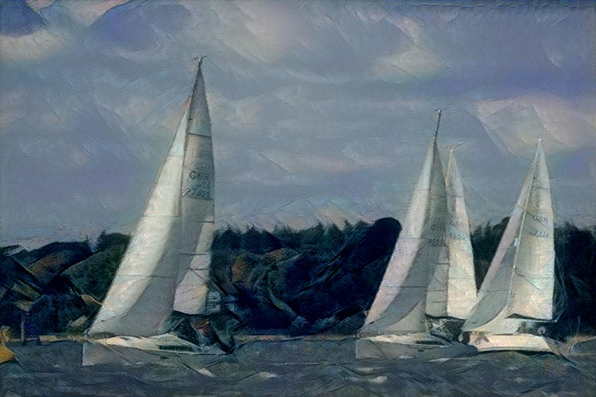
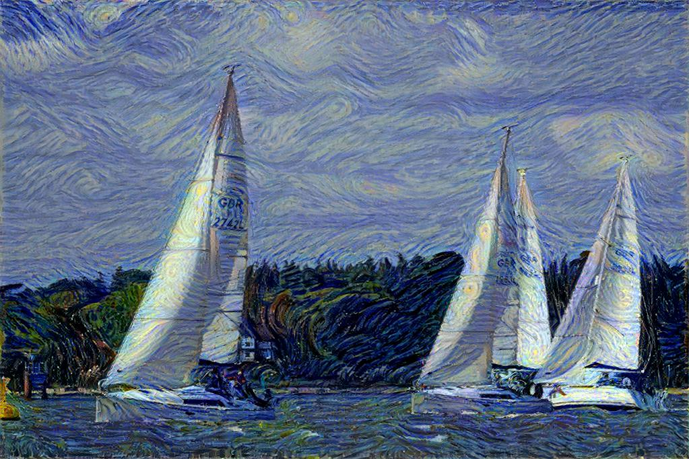
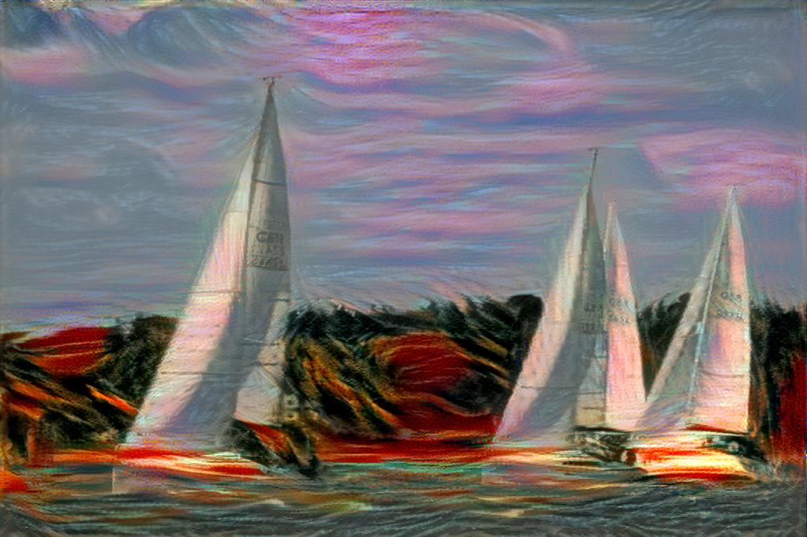

# Style Transfer (Neural Style)

A tensorflow implementation of style transfer described in [A Neural Algorithm of Artistic Style](https://arxiv.org/pdf/1508.06576v2.pdf) and [Image Style Transfer Using Convolutional Neural Networks](http://www.cv-foundation.org/openaccess/content_cvpr_2016/papers/Gatys_Image_Style_Transfer_CVPR_2016_paper.pdf) by Leon A. Gatys, Alexander S. Ecker, Matthias Bethge.

## Usage

### Prerequisites
Before using the network, you must download the pre-trained weight for ImageNet: [imagenet-vgg-verydeep-19.mat](http://www.vlfeat.org/matconvnet/models/imagenet-vgg-verydeep-19.mat)

Once downloaded, put the `.mat` file in the `pre_trained_model` folder.

### Running
```
python run_main.py --content <content file> --style <style file> --output <output file>
```

To see all the arguments, run `python run_main.py` without argments.

Also available is a shell script that takes the input image as argument and applies all the styles in the `images` folder; the input image must be in the same directory as the script itself; example
```
sh style_it.sh regata.jpg
```
## References

The implementation is based on the projects:

#### https://github.com/Hvass-Labs/TensorFlow-Tutorials/blob/master/15_Style_Transfer.ipynb
* This is a tutorial version with plenty of comments

#### https://github.com/anishathalye/neural-style

#### https://github.com/cysmith/neural-style-tf

## Results

#### Original picture (from out social event):


#### Results:



---


---


